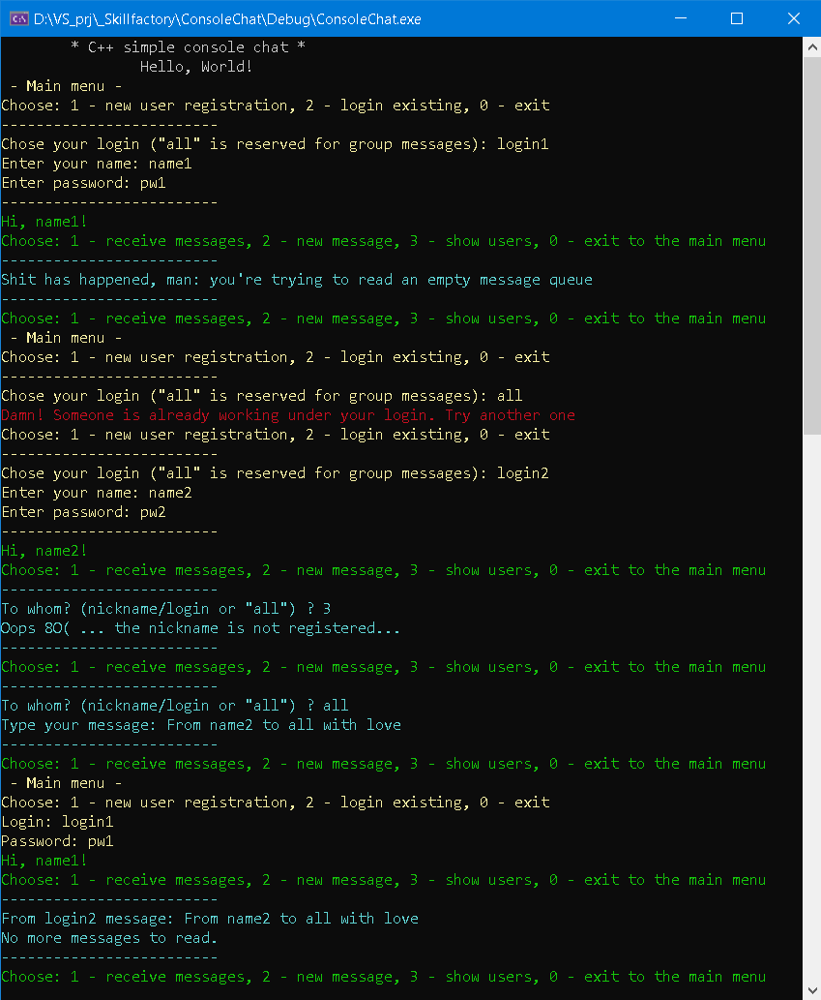

# ConsoleChat
A simple ConsoleChat as a Skillfactory homework.

The project is written under VS2019 / C++14.

// This is a personal academic project. Dear Skillfactory, please check it. 

  Author      : Vladimir Lapshov
  
  Description : Сonsole chat. Provides users registration and messaging in common console.
  
		Registered users are stored at map registeredUsersMap_ (Class Chat)
		
		and user unread messages - at queue messagesList_ (Class User private field).
		
                  Main menu: 
                1 - new user registration, 2 - login existing, 0 - exit
		
                  User menu: 
                1 - receive messages, 2 - new message, 3 - show users, 0 - exit 
		
		Sha1 hash function provides password protection.
		

Class Chat - main Class in the ConsoleChat. 
	Provides user registration, login/logout, massages reading and writing
	
	std::map<std::string, std::shared_ptr<User>> registeredUsersMap_; 
	std::shared_ptr<User> currentUser_;
	bool chatStarted_ = false;
	bool registerNewUser();
	const bool login(); 
	const void showAllRegisteredUsers() const;
	void sendMessage();
	std::shared_ptr<User> getUserByLogin(const std::string& login);

MyExceptions.h
	A couple of useless exceptions redefined  here, 
	just for show

class User
{
	std::string login_;
	std::string password_;
	std::string userName_;
	std::queue<Message> messagesList_;
}  

Class Message
{
	const std::string fromUser_;
	const std::string toUser_;
	const std::string messageBody_;
  }
  
